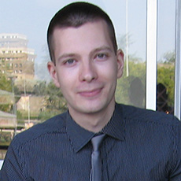

{:style="float: left;margin-right: 30px;margin-top: 25px;"}
# Vuk Batanović 
Contact e-mail: vuk.batanovic / at / student.etf.bg.ac.rs

***

# About me
I am currently a PhD candidate at the School of Electrical Engineering, University of Belgrade, Serbia.
I study natural language processing or, more specifically, computational models of semantic similarity and sentiment analysis.
One of my main fields of interest is dealing with the particularities of short-text processing.
In addition, I am focused on creating solutions which are easily applicable not only to English, but to other, less prominent languages as well.

***

# Education
* 2012 - present - PhD in natural language processing, Department of software engineering, School of Electrical Engineering, University of Belgrade, GPA 10/10.
Planned thesis: *A methodology for solving semantic tasks in the processing of short texts written in natural languages with limited resources*
* 2010 - 2011 - Master's degree, Department of computer science and Engineering, School of Electrical Engineering, University of Belgrade, GPA 10/10
Thesis: *An expert system for determining the semantic similarity of short texts in Serbian*
* 2006 - 2010 - Bachelor's degree, Department of computer science and Engineering, School of Electrical Engineering, University of Belgrade, GPA 9.56/10
Thesis: *A visual simulator of search algorithms*

## Summer schools and seminars
* *[ESSLLI 2016](http://esslli2016.unibz.it/)* – 28th European Summer School in Logic, Language and Information, Free University of Bozen-Bolzano, Italy
* *[LxMLS 2016](http://lxmls.it.pt/2016/)* – 6th Lisbon Machine Learning Summer School, Instituto Superior Técnico, Portugal
* *[ReLDI (Regional Linguistic Data Initiative)](http://reldi.spur.uzh.ch/seminars/)* seminars in Belgrade and Zagreb, 2016-2017

## Online courses
* Natural Language Processing, Stanford University, Coursera
* Natural Language Processing, Columbia University, Coursera
* Machine Learning, Stanford University, Coursera
* Introduction to Natural Language Processing, University of Michigan, Coursera
* Miracles of Human Language: An Introduction to Linguistics, Universiteit Leiden, Coursera
* Text Retrieval and Search Engines, University of Illinois at Urbana-Champaign, Coursera
* The Data Scientist’s Toolbox, Johns Hopkins University, Coursera
* Data Mining with Weka, University of Waikato
* More Data Mining with Weka, University of Waikato

***

# Research

## Papers
* *[Sentiment Classification of Documents in Serbian: The Effects of Morphological Normalization](https://www.researchgate.net/publication/312540228_Sentiment_Classification_of_Documents_in_Serbian_The_Effects_of_Morphological_Normalization)*, Vuk Batanović, Boško Nikolić, in Proceedings of the 24th Telecommunications Forum (TELFOR 2016), Belgrade, Serbia (2016).
* *[Reliable Baselines for Sentiment Analysis in Resource-Limited Languages: The Serbian Movie Review Dataset](https://www.researchgate.net/publication/303089151_Reliable_Baselines_for_Sentiment_Analysis_in_Resource-Limited_Languages_The_Serbian_Movie_Review_Dataset)*, Vuk Batanović, Boško Nikolić, Milan Milosavljević, in Proceedings of the 10th International Conference on Language Resources and Evaluation (LREC 2016), Portorož, Slovenia, pp. 2688–2696 (2016).
* *[Using Part-of-Speech Tags as Deep-Syntax Indicators in Determining Short-Text Semantic Similarity](https://www.researchgate.net/publication/272091124_Using_Part-of-Speech_Tags_as_Deep-Syntax_Indicators_in_Determining_Short-Text_Semantic_Similarity)*, Vuk Batanović, Dragan Bojić, Computer Science and Information Systems, vol. 12, no. 1, pp. 1–31 (2015).
* *[Evaluation and Classification of Syntax Usage in Determining Short-Text Semantic Similarity](https://www.researchgate.net/publication/266146366_Evaluation_and_Classification_of_Syntax_Usage_in_Determining_Short-Text_Semantic_Similarity)*, Vuk Batanović, Dragan Bojić, Telfor Journal vol. 6, no. 2, pp. 64–68 (2014).
* *[Evaluacija i klasifikacija korišćenja sintaksnih informacija u određivanju semantičke sličnosti kratkih tekstova](https://www.researchgate.net/publication/261120444_Evaluacija_i_klasifikacija_koriscenja_sintaksnih_informacija_u_odredivanju_semanticke_slicnosti_kratkih_tekstova_Evaluation_and_Classification_of_Syntax_Information_Usage_in_Determining_Short-Text_Sem)*, Vuk Batanović, Dragan Bojić, in Proceedings of the 21st Telecommunications Forum (TELFOR 2013), Belgrade, Serbia, pp. 821–824 (2013). *(paper in Serbian)*
* *[Semantic similarity of short texts in languages with a deficient natural language processing support](https://www.researchgate.net/publication/257015880_Semantic_similarity_of_short_texts_in_languages_with_a_deficient_natural_language_processing_support)*, Bojan Furlan, Vuk Batanović, Boško Nikolić, Decision Support Systems, vol. 55, no. 3, pp. 710-719 (2013).
* *[Softverski sistem za određivanje semantičke sličnosti kratkih tekstova na srpskom jeziku](https://www.researchgate.net/publication/254049616_Softverski_sistem_za_odredivanje_semanticke_slicnosti_kratkih_tekstova_na_srpskom_jeziku_A_software_system_for_determining_the_semantic_similarity_of_short_texts_in_Serbian)*, Vuk Batanović, Bojan Furlan, Boško Nikolić, in Proceedings of the 19th Telecommunications Forum (TELFOR 2011), Belgrade, Serbia, pp. 1249-1252 (2011). *(paper in Serbian)*
* *[Sofverski sistem za učenje ekspertskih sistema](https://www.researchgate.net/publication/266146671_Sofverski_sistem_za_ucenje_ekspertskih_sistema_Software_System_for_Expert_Systems_Learning), Dražen Drašković, Vuk Batanović, Boško Nikolić, in Proceedings of the 18th Telecommunications Forum (TELFOR 2010)*, Belgrade, Serbia, pp. 1129-1132 (2010). *(paper in Serbian)*

## Research projects
* 2016-2017 - Research collaborator on the *[ReLDI (Regional Linguistic Data Initiative)](http://reldi.spur.uzh.ch/)* SNSF SCOPES project 160501 -  a two-year institutional partnership between research units in Switzerland, Serbia and Croatia. I participated in the creation, distribution and analysis of linguistic/NLP datasets and tools for Serbian and Croatian.

## Created datasets and tools
* *[Serbian Movie Review Dataset (SerbMR)](https://vukbatanovic.github.io/SerbMR)* - sentiment analysis document collection
* *SRSentiComments Dataset* - sentiment analysis short-text collection
* *[NBSVM-Weka](https://vukbatanovic.github.io/NBSVM-Weka)* - a multiclass NBSVM implementation for Weka 
* *[SCStemmers](https://vukbatanovic.github.io/SCStemmers)* - a collection of stemmers for Serbian and Croatian
* *[Serbian Paraphrase Corpus (SRParaphrase)](https://vukbatanovic.github.io/SRParaphrase)* - semantic textual similarity short-text collection
* *[LinSTSS](https://bitbucket.org/bfurlan/semsim)* and *POST STSS* - algorithms for determining the semantic similarity of short texts, particularly suitable for languages with limited NLP resources/tools

## Grants and awards
* Elsevier grant for ESSLLI 2016 participation
* Scholarship of the Fund for Young Talents of the Republic of Serbia

***

# Professional interests and skills
* Sentiment analysis
* Semantic similarity
* Distributional semantics
* Short-text processing
* Multilingual NLP solutions
* NLP for under-resourced languages
* (Deep) machine learning

## Programming languages
* Java
* Python
* C++
* C#
* C
* Matlab
* SQL

## Language proficiency
* Serbian (native)
* English (fluent, *Cambridge Certificate of Proficiency in English (CPE), grade A*)
* French (limited)

***

# Other profiles
* {:height="12px" width="12px} [My Github repos](https://github.com/vukbatanovic)
* {:height="12px" width="12px"} [LinkedIn](http://www.linkedin.com/in/vukbatanovic)
* {:height="12px" width="12px"} [Google Scholar](https://scholar.google.com/citations?user=hNfP92YAAAAJ&hl=en)
* {:height="12px" width="12px"} [ResearchGate](http://www.researchgate.net/profile/Vuk_Batanovic)
* {:height="12px" width="12px"} [Academia.edu](http://etf.academia.edu/VukBatanović)
* {:height="12px" width="12px"} [Mendeley](https://www.mendeley.com/profiles/vuk-batanovic/)

***
